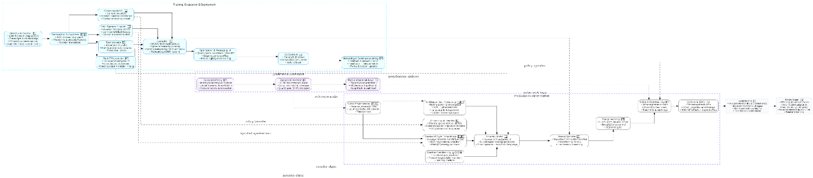
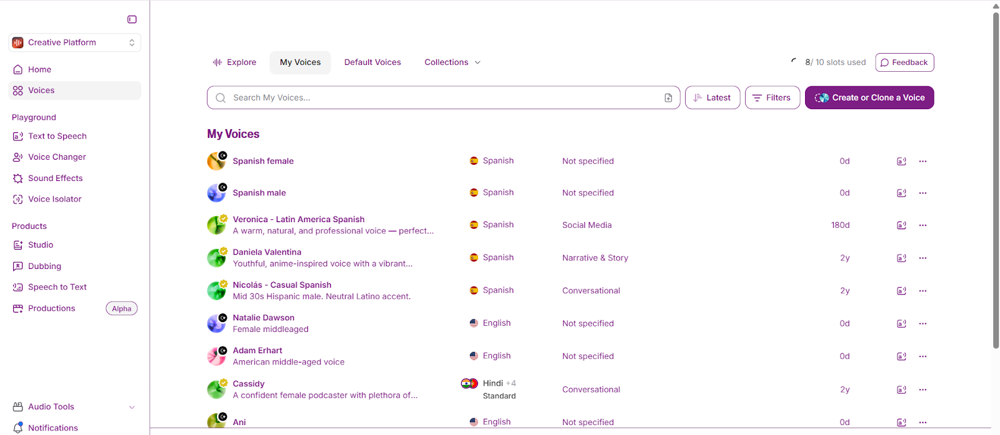
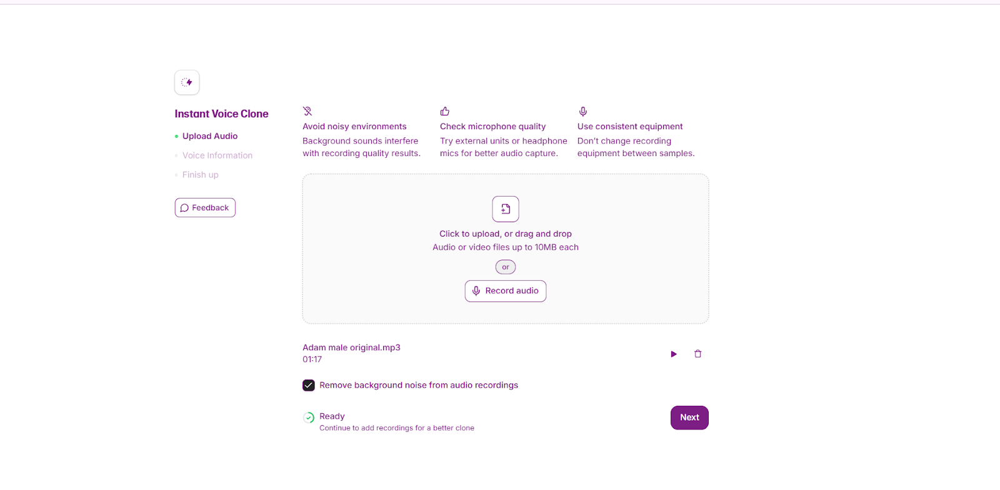
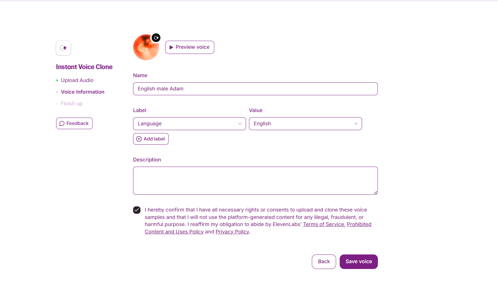

# Voice Cloning

Voice Cloning is an advanced AI-powered technology that can accurately replicate a person’s voice with natural tone, emotional depth, and multilingual adaptability. Unlike older synthetic voice systems, it preserves the speaker’s unique vocal identity—capturing their timbre, rhythm, and personality—while allowing speech to be generated in different languages without losing authenticity.

The tool supports a wide range of emotions, from casual conversation to expressive storytelling, making digital voices sound more personal and lifelike. With fast processing and scalable applications, Voice Cloning is ideal for content creators, businesses, entertainment, customer service, and accessibility solutions, offering realistic speech for a wide variety of digital platforms.

---

## 📌 Scheme

---

## ⚙️ Technical Description
Voice cloning combines **deep learning models** with **speech synthesis** to replicate human voices. By analyzing vocal patterns (tone, rhythm, pitch, and timbre), the system creates a digital voiceprint. This voiceprint can then be used to generate speech in multiple languages and emotional tones, while retaining the speaker’s unique identity.

---

## Examples
- Audiobooks narrated in the author’s own voice across different languages.
- Personalized voice assistants with the exact voice of the user.
- Film dubbing while preserving the actor’s real voice.
- Accessibility tools for speech-impaired users to restore their natural voice.

<table>
    <tbody>
        <tr>
            <td></td>
            <td></td>
        </tr>
        <tr>
            <td></td>
            <td></td>
        </tr>
    </tbody>
</table>

---

## Long Description
Digital communication keeps evolving, and with it comes the need for voices that feel real, personal, and human. This new voice cloning technology was created to meet that need. It doesn’t just read words aloud—it learns the unique qualities of a person’s voice, carries emotion, and speaks in multiple languages while still sounding authentic. By capturing the natural rhythm, tone, and feeling of speech, it brings conversations with machines closer to real human interaction.

---

## Problem
Older voice systems often sounded robotic and flat. They could read text, but the results lacked the warmth and individuality of a real person’s voice. Most of these systems worked only in one language, making them feel outdated and restrictive. In today’s multilingual world, people needed something that could break these barriers and deliver voices that feel alive, emotional, and adaptable.

---

## Solution
This new voice cloning system takes speech technology to the next level. It uses advanced learning methods to copy the details that make every voice unique—tone, pitch, style—and keeps them intact, even when switching languages. Beyond simple text-to-speech, it adds the ability to carry emotion, so the voice doesn’t just sound clear, it also sounds **human**.

Whether it’s joy, sadness, or calm, the technology makes digital voices expressive, relatable, and natural.

---

## Process
1. **Collecting and Preparing Data**  
   Large collections of voices in different languages were gathered, cleaned, and pre-processed for model training.

2. **Studying Voice Features**  
   Neural networks analyzed vocal elements like pitch, rhythm, and tone.

3. **Training the Model**  
   A combination of **Tacotron 2** and **WaveNet** generated natural, fluid speech while preserving voice identity.

4. **Adding Emotion**  
   Emotion-labeled datasets allowed the model to replicate happiness, sadness, excitement, and more.

5. **Making It Multilingual**  
   Transformer-based models enabled smooth, natural multilingual speech while retaining voice identity.

---

## Achievements
- **Voice Cloning Accuracy:** ~95% similarity in listener tests.
- **Multilingual Capability:** English, Mandarin, Spanish, French, Arabic.
- **Emotional Range:** Happiness, sadness, anger, fear, and neutral states.
- **Processing Speed:** 30% faster synthesis, enabling near real-time cloning.
- **Dataset Expansion:** Over **10,000 hours of speech** curated for training.

---

## Further Improvements & Future Scope
- **Model Efficiency:** Reduce memory & power usage for low-end devices.
- **Accent & Dialect Adaptation:** Capture regional speech diversity.
- **Improved Emotional Intelligence:** More nuanced, context-aware emotions.
- **Cross-Lingual Voice Transfer:** Retain voice identity across languages.
- **Noise Resilience:** Better performance in noisy environments.
- **Real-Time Learning:** Adaptive voices that evolve with continued use.

---

## References
- *Tacotron 2: Towards End-to-End Speech Synthesis* — Jonathan Shen et al.
- *WaveNet: A Generative Model for Raw Audio* — Aaron van den Oord et al.
- *A Review of Text-to-Speech Synthesis for Indian Languages* — Ravi Shankar Mishra et al.
- *Emotion Recognition from Speech: A Review* — Chandra Sekhar Yadav Jampala et al.
- *Efficient Multilingual Speech Synthesis with Tacotron 2 and SpeedySpeech* — Jiatao Gu et al.

---
